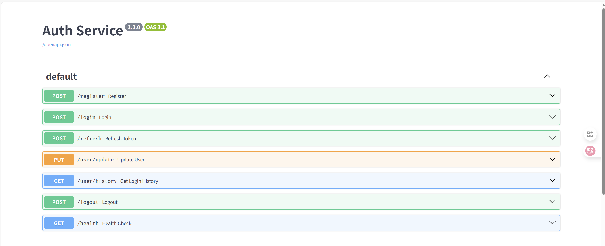

# Experiment 4 : Auth Service  with JWT
Author: Ши Цзинбо
Class: 30701

## **Project Overview**

Experiment 4. This is a **secure authentication service** built with FastAPI, implementing JWT-based user authentication and authorization. Features user registration, login, token refresh, and secure token management.




## Features

-    User registration & login with JWT tokens
    
-    Access/Refresh token mechanism
    
-    Token refresh endpoint
    
-    User profile update
    
-    Login history tracking
    
-    Secure logout with token blacklist (Redis)
    
-    PostgreSQL database for user data
    
-    Docker containerization
    
-    Auto-generated API documentation

##  **Project Structure**
auth-service/
├── app/
│   ├── __init__.py
│   ├── main.py              # Точка входа в приложение FastAPI
│   ├── config.py            # Управление конфигурацией
│   ├── database.py          # Подключение к базе данных
│   ├── models.py            # Определение модели данных
│   ├── schemas.py           # Pydantic модель
│   ├── crud.py              # операции с базой данных
│   ├── auth.py              # Логика аутентификации
│   └── dependencies.py      # FastAPI Зависимости
├── docker-compose.yml       # Docker Compose Конфигурация
├── Dockerfile              # Docker Конфигурация образа
├── requirements.txt        # Python repuir
├── .env.example            # Примеры переменных окружающей среды
├── wait-for-db.sh          #скрипт ожидания базы данных
├── init_db.py              # Скрипт инициализации базы данных
├── p2.png              # изображения auth service
└── README.md              # Вот этот документ

## Quick Start


**Step 1**   **Clone and setup** 
```python
cd auth-service
cp .env.example .env
# delete my .env file if needed
```
 **Step 2**    **Start services**

```python
docker-compose up -d --build
```
Check if services are running
```python
docker-compose ps
```
View application logs
```python
docker-compose logs app --tail=20
```
 **Step 3  Access the service**

-   API Docs: [http://localhost:8000/docs](http://localhost:8000/docs)
-   Health: [http://localhost:8000/health](http://localhost:8000/health)


## For example:


### Register User
```bash
curl -X POST "http://localhost:8000/register" \
  -H "Content-Type: application/json" \
  -d '{"email": "shijingbo@spbstu.com", "password": "password123"}'
```
### Login
```bash
curl -X POST "http://localhost:8000/login" \
  -H "Content-Type: application/json" \
  -d '{"email": "shijingbo@spbstu.com", "password": "password123"}'
```
### Access Protected Endpoint

```bash
curl -X GET "http://localhost:8000/user/history" \
  -H "Authorization: Bearer YOUR_ACCESS_TOKEN"